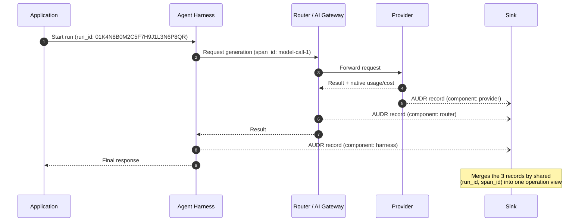

# AUDR — Agent Usage Detail Record

[](https://github.com/openaudr/audr/actions/workflows/spec-verify.yml)
[](https://github.com/openaudr/audr/actions/workflows/docs-verify.yml)
[](spec/SPEC.md)
[](https://pypi.org/project/audr/)
[](https://pypi.org/project/audr/)
[](LICENSE)

An open standard for recording who initiated an agent run and what each step
cost, across every system the run passes through.

A single agent run touches several systems. The application knows the customer
and the feature. The router knows the model, the tokens and the price. The
provider knows the cache split. The harness knows whether the run actually
resolved anything. Every layer is observable on its own, and none of them can
tell you what that customer's agent cost you last month.

AUDR is one JSON record per metered operation, carrying enough identity and
attribution that the records join.

```json
{
  "spec_version": "1.0.0",
  "record_id": "01K4N8D2J4P7Q9R3S6T8V1W5XY",
  "emitter": { "component": "router", "name": "@audr/openrouter", "version": "0.5.1" },
  "timing": { "event_time": "2026-09-08T12:00:00.000Z" },
  "resource": {
    "provider": "anthropic",
    "type": "model",
    "name": "claude-sonnet-4-20250514",
    "operation": "generation",
    "modality": "text"
  },
  "run": { "run_id": "01K4N8B0M2C5F7H9J1L3N6P8QR", "span_id": "model-call-1" },
  "attribution": { "environment": "production", "account_id": "account-42" },
  "usage": { "llm": { "input_tokens": 1200, "output_tokens": 300 } }
}
```

## How a run flows across components

A single metered operation can pass through several components before it's
billable. Each participating component — harness, router, provider — MAY
independently emit its own AUDR record for that operation; records are never
deduplicated against each other, only merged, so each keeps its own
`record_id`. A sink assembles the records that share the same merge key,
`(run.run_id, run.span_id)`, into one view of the operation. See
[SPEC.md §1.2](spec/SPEC.md#12-architecture),
[§1.4](spec/SPEC.md#14-record-processing-model), and the
[Merge key definition](spec/SPEC.md#2-definitions) for the normative
description.



## Start here

| Path | Contains |
| --- | --- |
| [`spec/`](spec/SPEC.md) | The standard: [`SPEC.md`](spec/SPEC.md) to implement it, [`audr.schema.json`](spec/audr.schema.json) to validate records, [`examples/record.json`](spec/examples/record.json) for a complete record |
| [`conformance/`](conformance/README.md) | Language-neutral fixtures every implementation must reproduce |
| [`adapters/`](adapters/README.md) | Things that produce records — the [Python SDK](adapters/core/python/README.md) and runtime adapters |
| [`sinks/`](sinks/README.md) | Things that consume records — destinations such as Chargebee |
| `tools/` | The specification generator and the repository checks, driven by the [`Makefile`](Makefile) |

The schema's canonical URL is its `$id`:

```
https://openaudr.dev/spec/v1.0.0/audr.schema.json
```

Any JSON Schema Draft 2020-12 validator checks a record against it. In this
repository, `make examples` validates every example in the specification.

```bash
make check     # schema, examples, conformance, cross-references, staleness, links, versions
make spec      # regenerate spec/SPEC.md from the schema, the outline and the prose
```

## Emitting records

Three parts work together. An **adapter** observes an agent runtime and builds a record per
metered operation; the **core SDK** validates, batches and accounts for records through a
`Client`; a **sink** delivers each batch to a destination. Install the core and a sink, wrap
the sink in a client, and either call `client.record()` yourself or let an adapter do it.

```bash
pip install audr audr-sink-chargebee
```

```python
import asyncio

import audr
from audr_sink_chargebee import ChargebeeSink

# The record shown above, built with the SDK. record_id, spec_version and
# timing.event_time are defaulted; Chargebee additionally routes on subscription_id.
record = audr.AUDR(
    timing=audr.Timing(),
    resource=audr.Resource(
        provider="anthropic",
        type="model",
        name="claude-sonnet-4-20250514",
        operation="generation",
        modality="text",
    ),
    run=audr.Run(run_id="01K4N8B0M2C5F7H9J1L3N6P8QR", span_id="model-call-1"),
    attribution=audr.Attribution(
        environment="production", account_id="account-42", subscription_id="sub-42"
    ),
    usage=audr.Usage(llm=audr.LlmUsage(input_tokens=1200, output_tokens=300)),
)


async def main() -> None:
    sink = ChargebeeSink(site="acme", api_key="cb_live_...")  # any Sink: a file, a queue, Chargebee
    async with audr.Client(
        sink,
        emitter=audr.Emitter(component="router", name="openrouter", version="1.12.1"),
    ) as client:
        result = client.record(record)  # an adapter makes this call on your behalf
        assert result.queued, result.issues
    print(client.stats)


asyncio.run(main())
```

| Part | Reference implementation | Guide |
| --- | --- | --- |
| Core SDK | [`audr`](adapters/core/python/README.md) | [`adapters/core/README.md`](adapters/core/README.md) — the `Client`, the sink contract, delivery states |
| Adapters | [`audr-adapter-litellm`](adapters/litellm/python/README.md), [`audr-adapter-nemo-relay`](adapters/nemo-relay/python/README.md) | [`adapters/README.md`](adapters/README.md) |
| Sinks | [`audr-sink-chargebee`](sinks/chargebee/python/README.md) | [`sinks/README.md`](sinks/README.md) |

## Status

The current specification version is [1.0.0](spec/SPEC.md).

## Governance

AUDR was drafted at Chargebee, and is being improved with collaboration across
the ecosystem. Granular cost and usage instrumentation are foundational to agent
unit economics — the infrastructure every team building or monetizing agents
will need. We believe that infrastructure should be open, neutral, and
community-owned. As adoption grows, the goal is to move cost governance to an
independent foundation.

Stewarded by Chargebee. Contact us at [audr@chargebee.com](mailto:audr@chargebee.com).

## Contributing

Tell us where AUDR breaks for a cost model you have and we haven't imagined.
[Open an issue](https://github.com/openaudr/audr/issues) or email
[audr@chargebee.com](mailto:audr@chargebee.com). See [CONTRIBUTING.md](CONTRIBUTING.md); participation is governed by
the [Code of Conduct](CODE_OF_CONDUCT.md).

## Security

To report a vulnerability, follow [SECURITY.md](SECURITY.md). It also states the
data-handling rules the format depends on: records carry no prompt content, no
key material, and no PII.

## License

[Apache 2.0](LICENSE). See [NOTICE](NOTICE).
