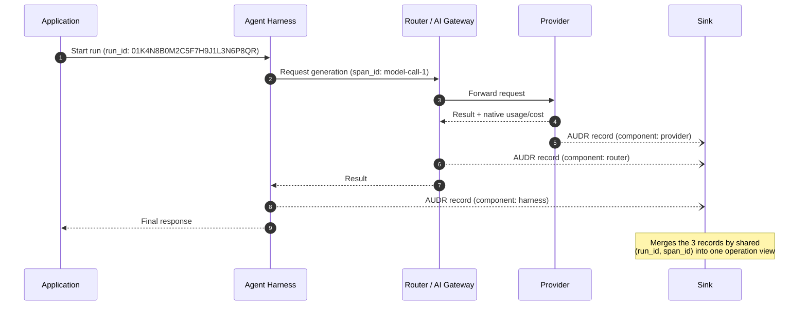

# AUDR — Agent Usage Detail Record

[](spec/v1.0.0/SPEC.md)
[](LICENSE)

An open standard for recording who initiated an agent run and what each step
cost, across every system the run passes through.

A single agent run touches several systems. The application knows the customer
and the feature. The router knows the model, the tokens and the price. The
provider knows the cache split. The harness knows whether the run actually
resolved anything. Every layer is observable on its own, and none of them can
tell you what that customer's agent cost you last month.

AUDR is one JSON record per metered operation, carrying enough identity and
attribution that the records join.

```json
{
  "spec_version": "1.0.0",
  "record_id": "01K4N8D2J4P7Q9R3S6T8V1W5XY",
  "emitter": { "component": "router", "name": "@audr/openrouter", "version": "0.5.1" },
  "timing": { "event_time": "2026-09-08T12:00:00.000Z" },
  "resource": {
    "provider": "anthropic",
    "type": "model",
    "name": "claude-sonnet-4-20250514",
    "operation": "generation",
    "modality": "text"
  },
  "run": { "run_id": "01K4N8B0M2C5F7H9J1L3N6P8QR", "span_id": "model-call-1" },
  "attribution": { "environment": "production", "account_id": "account-42" },
  "usage": { "llm": { "input_tokens": 1200, "output_tokens": 300 } }
}
```

## How a run flows across components

A single metered operation can pass through several components before it's
billable. Each participating component — harness, router, provider — MAY
independently emit its own AUDR record for that operation; records are never
deduplicated against each other, only merged, so each keeps its own
`record_id`. A sink assembles the records that share the same merge key,
`(run.run_id, run.span_id)`, into one view of the operation. See
[SPEC.md §1.2](spec/v1.0.0/SPEC.md#12-architecture),
[§1.4](spec/v1.0.0/SPEC.md#14-record-processing-model), and the
[Merge key definition](spec/v1.0.0/SPEC.md#2-definitions) for the normative
description.



## Start here

| If you want to | Read |
| --- | --- |
| Implement it | [Specification v1.0.0](spec/v1.0.0/SPEC.md) |
| Validate records | [`audr.schema.json`](spec/v1.0.0/audr.schema.json) |
| See a complete record | [`record.json`](spec/v1.0.0/examples/record.json) |

The schema's canonical URL is its `$id`:

```
https://openaudr.dev/spec/v1.0.0/audr.schema.json
```

Validate the example against it with any JSON Schema Draft 2020-12 validator:

```bash
pip install jsonschema
python3 -c "
import json, urllib.request
from jsonschema import Draft202012Validator as V
schema = json.load(urllib.request.urlopen('https://openaudr.dev/spec/v1.0.0/audr.schema.json'))
V(schema).validate(json.load(open('spec/v1.0.0/examples/record.json')))
print('valid')
"
```

## Status

| Version | Status |
| --- | --- |
| [1.0.0](spec/v1.0.0/SPEC.md) | Current. |

## Governance

AUDR was drafted at Chargebee, and is being improved with collaboration across
the ecosystem. Granular cost and usage instrumentation are foundational to agent
unit economics — the infrastructure every team building or monetizing agents
will need. We believe that infrastructure should be open, neutral, and
community-owned. As adoption grows, the goal is to move cost governance to an
independent foundation.

Stewarded by Chargebee. Contact us at <audr@chargebee.com>.

## Contributing

Tell us where AUDR breaks for a cost model you have and we haven't imagined.
[Open an issue](https://github.com/openaudr/audr/issues) or email
<audr@chargebee.com>. See [CONTRIBUTING.md](CONTRIBUTING.md).

## Security

To report a vulnerability, follow [SECURITY.md](SECURITY.md). It also states the
data-handling rules the format depends on: records carry no prompt content, no
key material, and no PII.

## License

[Apache 2.0](LICENSE). See [NOTICE](NOTICE).
