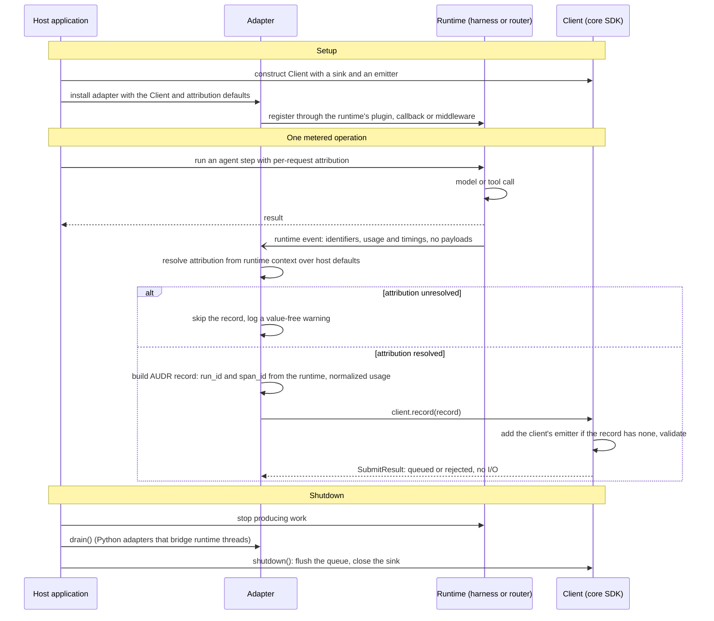

# Adapters

An adapter observes a harness, router, or other agent runtime and turns its own events into
[AUDR](../spec/SPEC.md) records, which it hands to a `Client` built on the
[core SDK](core/README.md). It never talks to a destination directly — that is a
[sink's](../sinks/README.md) job.

The host application owns the `Client` and its sink; the adapter receives the client and
feeds it one record per metered operation. A record that cannot be attributed is skipped
rather than billed to a guess.

TypeScript adapters have no `drain()`: stop the runtime, then await `client.shutdown()`. The
SDK mints each record's `record_id`; the client batches queued records and delivers them
through the sink, as the [sink workflow](../sinks/README.md) shows.

The core SDK is located here because every adapter depends on it, and because an
application that emits records directly uses the core alone: the null adapter.

## Adapters

| Adapter | Directory | Distribution | CI |
| --- | --- | --- | --- |
| Core (null adapter) | [`core/`](core/) |   |   |
| NVIDIA NeMo Relay | [`nemo-relay/`](nemo-relay/) |  |  |
| LiteLLM | [`litellm/`](litellm/) |  |  |
| Merge Gateway | [`merge-gateway/`](merge-gateway/) |  |  |
| Vercel AI SDK | [`vercel-ai/`](vercel-ai/) |  |  |
| Mastra | [`mastra/`](mastra/) |  |  |

## Contributing

[`CONTRIBUTING.md`](CONTRIBUTING.md) describes how to propose and build a new adapter.
[`AGENTS.md`](AGENTS.md) holds the invariants for work in this tree and a brief for
creating an adapter.
