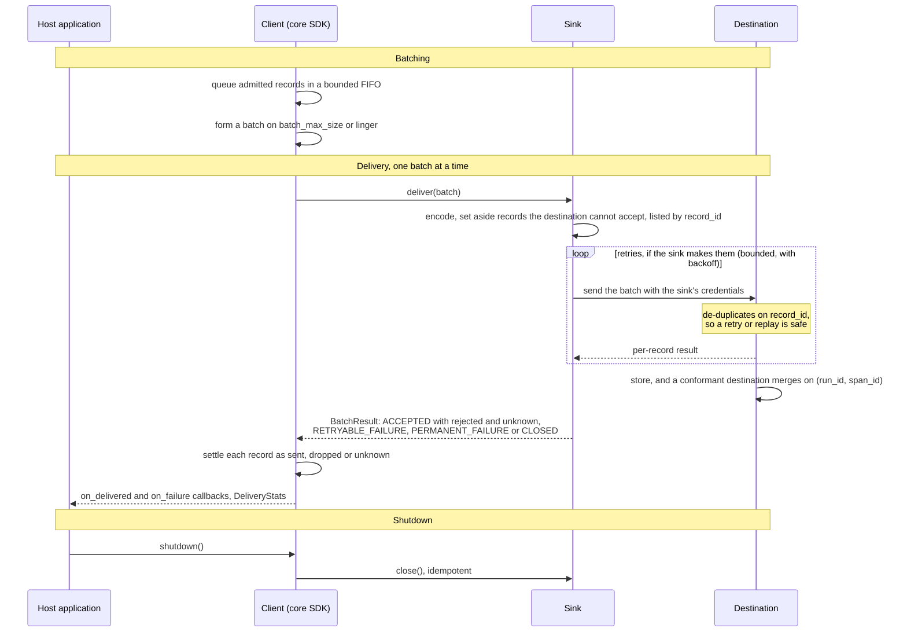

# Sinks

A sink receives [AUDR](../spec/SPEC.md) records from a `Client` built on the
[core SDK](../adapters/core/README.md) and delivers them to a destination: a file, a
warehouse, Chargebee. It owns encoding, transport, credentials, retries, and any
destination-specific byte limits. The core never talks to a destination directly, and a
sink never talks to a runtime — that is an [adapter's](../adapters/README.md) job.

The specification calls this ingest layer the sink: a conformant one de-duplicates on
`record_id` and merges records that share `(run_id, span_id)`. A sink package delivers each
batch to it and reports, per record, what the destination did.

A sink implements two asynchronous operations, `deliver()` and `close()`, and answers each
batch with a typed outcome. The contract — including what the pipeline guarantees a sink
and how each outcome affects the records in a batch — is defined in
[`adapters/core/README.md`](../adapters/core/README.md#the-sink-contract).

A sink forwards the whole record. Every field it is given, including `attribution.labels`
and any `x_*` extension, reaches the destination, and nothing downstream re-checks the
data-handling rules in [`SECURITY.md`](../SECURITY.md). Whatever a record must not carry,
it must not carry at the point it is built.

## Sinks

| Sink | Directory | Distribution | CI |
| --- | --- | --- | --- |
| Chargebee | [`chargebee/`](chargebee/) |   |   |

## Contributing

[`CONTRIBUTING.md`](CONTRIBUTING.md) describes how to propose and build a new sink.
[`AGENTS.md`](AGENTS.md) holds the invariants for work in this tree and a brief for
creating a sink.
